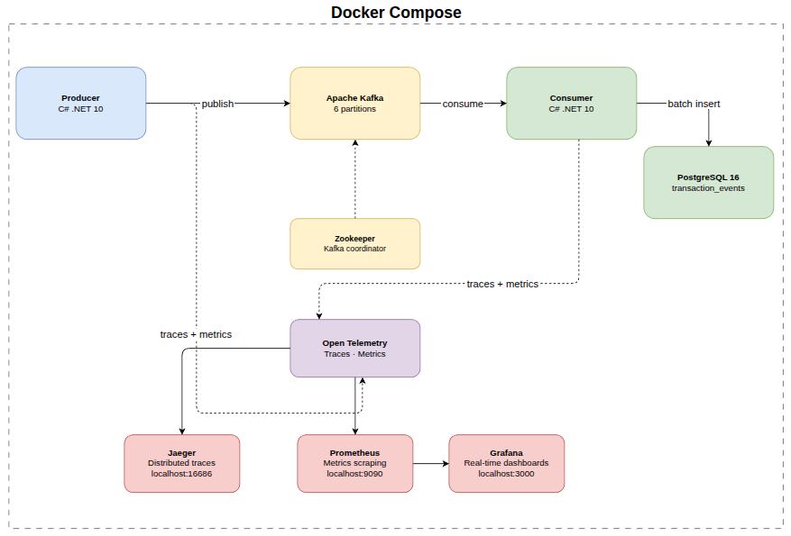
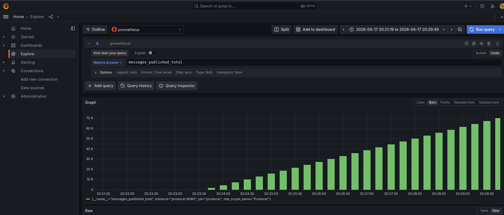
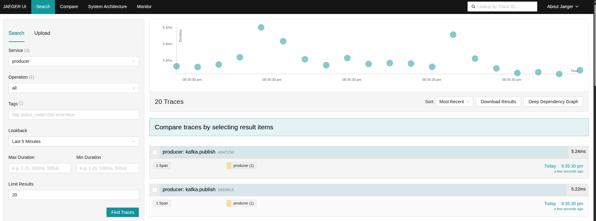

# Transaction Stream Processor

High-throughput financial transaction pipeline built with Apache Kafka and C# .NET 10. Produces and consumes 10K+ events/sec with parallel processing and full observability via OpenTelemetry, Jaeger, and Prometheus.

---

## What is this?

This project simulates a real-world financial transaction streaming system. A **Producer** generates synthetic bank transactions at high throughput and publishes them to a Kafka topic. A **Consumer** reads those events in parallel, validates them, and persists them to PostgreSQL using batch inserts - a critical optimization that pushes throughput from ~800 tx/sec to 9,200+ tx/sec.

The system is fully containerized with Docker Compose and instrumented with OpenTelemetry - every message publish and database insert is traced end-to-end in Jaeger, and throughput metrics are visible in real time via Prometheus and Grafana.

---

## Architecture



```
Producer (C# .NET 10)
    └── Generates 10K+ transactions/sec using Bogus
    └── Publishes to Kafka topic: transactions
    └── Traces every publish via OpenTelemetry → Jaeger

Kafka
    └── Distributes messages across partitions by AccountFrom

Consumer - C# .NET 10
    └── Reads from 6 partitions in parallel
    └── Validates each transaction (amount > 0, not null)
    └── Persists to PostgreSQL via batch inserts
    └── Idempotent: ON CONFLICT DO NOTHING on event_id
    └── Traces every consume + db insert via OpenTelemetry → Jaeger

Observability
    └── Jaeger → distributed traces
    └── Prometheus → metrics scraping
    └── Grafana → real-time dashboards
```

---

## Results

### Throughput - Grafana


### Distributed Traces - Jaeger


### Transactions in PostgreSQL
```sql
SELECT COUNT(*) FROM transaction_events;
-- 120,285+ rows after a few minutes
```

---

## Tech Stack

- **C# .NET 10** - Producer and Consumer services
- **Apache Kafka** - Message broker with 6 partitions
- **PostgreSQL 16** - Append-only event store
- **Confluent.Kafka** - Kafka client for .NET
- **Dapper** - Lightweight ORM for batch inserts
- **Bogus** - Synthetic financial data generation
- **OpenTelemetry** - Distributed tracing and metrics
- **Jaeger** - Trace visualization
- **Prometheus + Grafana** - Metrics and dashboards

---

## How to run

**Prerequisites:** Docker and Docker Compose installed.

```bash
# Clone the repo
git clone https://github.com/your-username/transaction-stream-processor
cd transaction-stream-processor

# Start everything
docker compose up --build -d

# Verify transactions are being processed
docker exec -it postgres psql -U finstream -d finstream -c "SELECT COUNT(*) FROM transaction_events;"
```

**Open the UIs:**

| Service    | URL                    | Credentials              |
|------------|------------------------|--------------------------|
| Grafana    | http://localhost:3000  | finstream / finstream    |
| Jaeger     | http://localhost:16686 | -                        |
| Prometheus | http://localhost:9090  | -                        |

**Stop everything:**
```bash
docker compose down
```

---

MIT